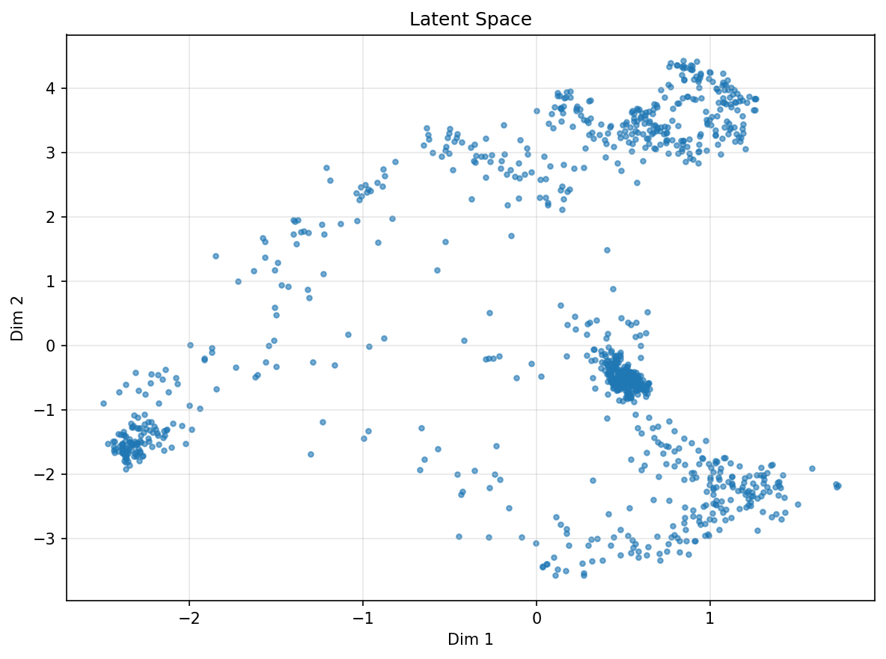
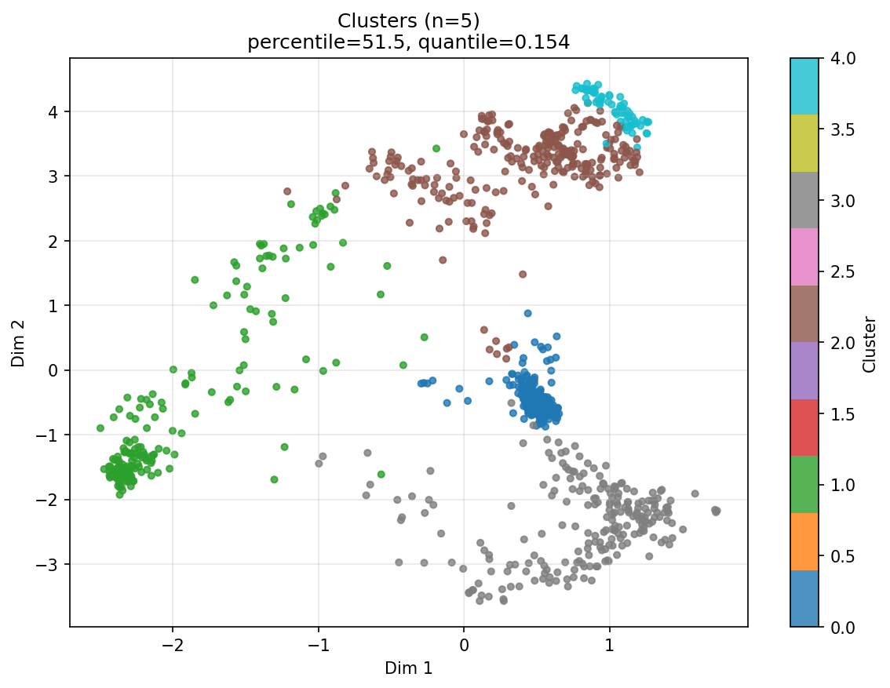
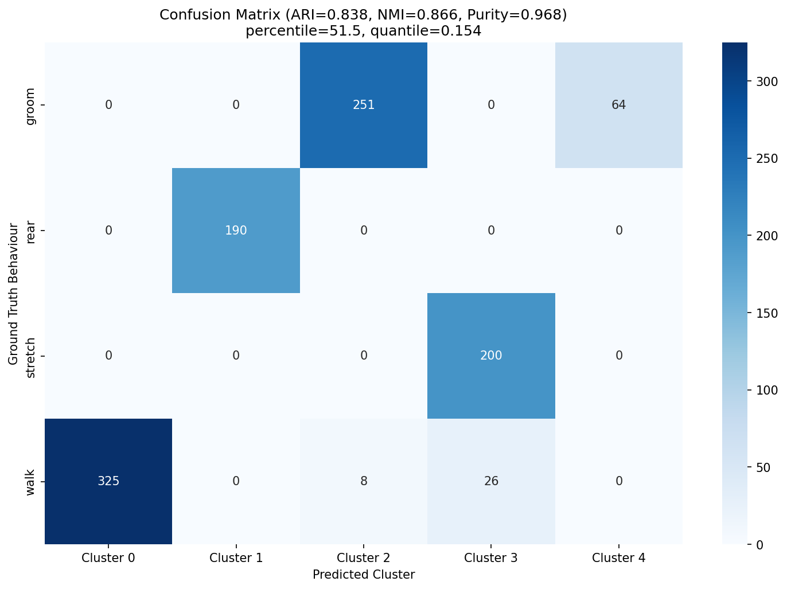
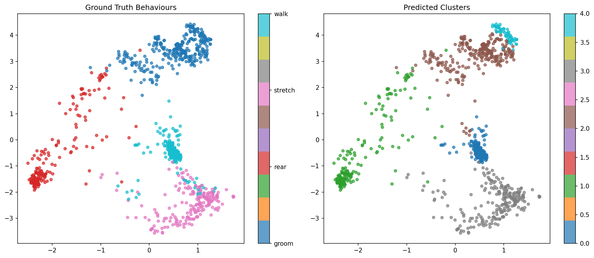
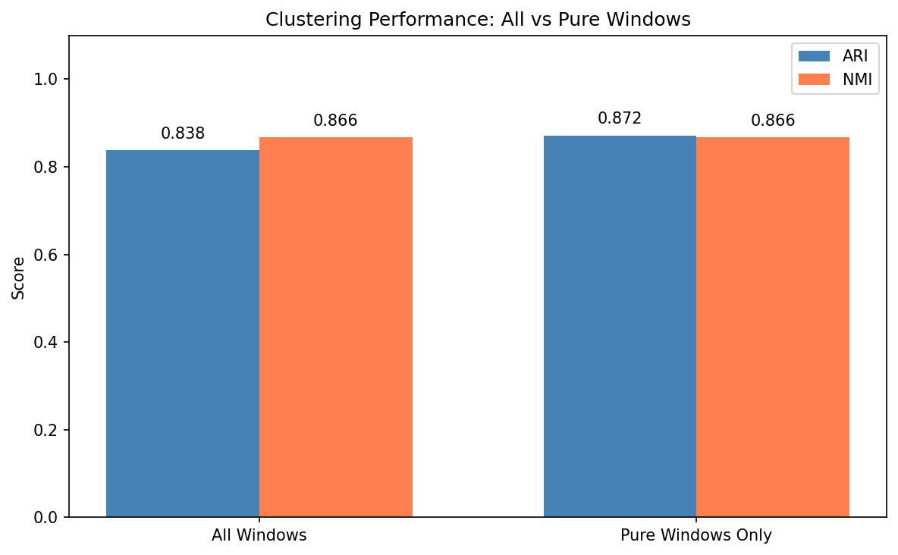
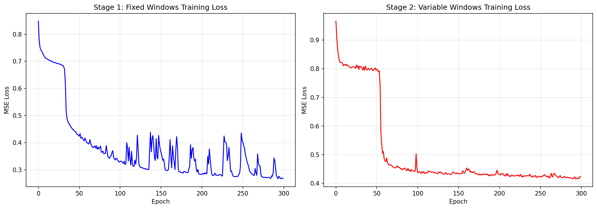
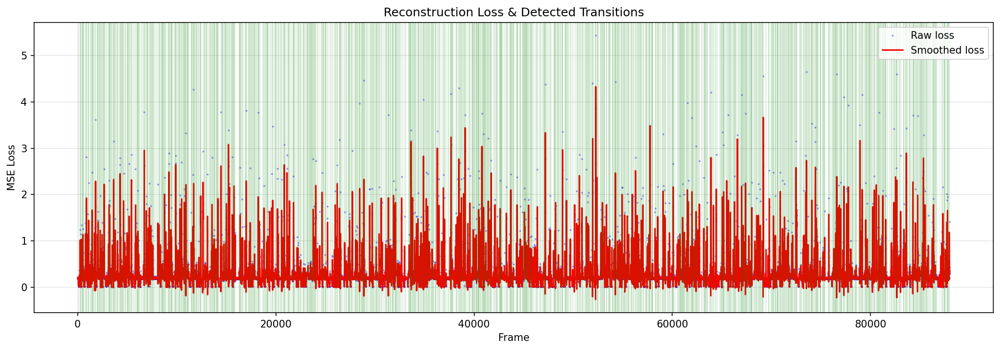

# HRAE Jackie - Rat Skeleton Movement Analysis

A project for generating synthetic rat skeleton movement data and performing unsupervised behavior clustering using a Hierarchical Recurrent Autoencoder (RAE) pipeline with hyperparameter tuning.

## Overview

This project consists of two main components:

1. **Synthetic Data Generation** - Generates ~88,000 frames of synthetic rat skeleton data with 4 distinct behaviors: walk, rear, groom, and stretch.
2. **Behavior Clustering Pipeline** - A multi-stage deep learning pipeline with automatic hyperparameter tuning that uses a Hierarchical Recurrent Autoencoder, UMAP dimensionality reduction, and MeanShift clustering to discover and classify behavioral patterns.

## Files

| File | Description |
|------|-------------|
| `fake_skeleton.py` | Script to generate synthetic rat skeleton movement data with labeled behaviors |
| `validation_code.ipynb` | Jupyter notebook containing the full pipeline: data loading, preprocessing, hyperparameter search, model training, clustering, validation, and result export |
| `rat_movement_large.npy` | Generated skeleton positions array (88000, 7, 2) - frames x body parts x (x,y) coordinates |
| `rat_movement_large_labels.npy` | Ground truth behavior labels for each frame |
| `rat_movement_large.json` | JSON annotations of skeleton positions per frame |
| `rat_movement_large_segments.json` | Ground truth behavior segments (behavior, start_frame, end_frame) |
| `ECG5000_TEST.csv` | ECG5000 test dataset (additional data) |

## Body Parts Tracked

- head
- center
- tail
- right_front_paw
- left_front_paw
- right_back_paw
- left_back_paw

## Behaviors

| Behavior | Description |
|----------|-------------|
| **Walk** | Forward locomotion with symmetric paw swing, body translates |
| **Rear** | Upright posture, front paws tucked high, static hold |
| **Groom** | Stationary, front paws oscillate rapidly toward face |
| **Stretch** | Body elongates, head and tail move far apart, front paws reach forward |

## Pipeline Stages

The analysis notebook (`validation_code.ipynb`) implements the following pipeline:

1. **Stage 1**: Train Hierarchical RAE on fixed-size non-overlapping windows (30 frames)
2. **Stage 2**: Compute frame-level reconstruction loss signal via sliding window
3. **Stage 3**: Detect behavioral transitions using peak detection on smoothed loss
4. **Stage 4**: Create variable-length behavioral windows from detected transitions
5. **Stage 4b**: Retrain RAE on variable-length windows
6. **Stage 5**: Encode windows to latent space, apply UMAP (16D -> 2D), cluster with MeanShift

### Hyperparameter Tuning

The notebook performs a random search over `percentile` (50-100) and `quantile` (0.05-0.50) parameters, iterating up to 20 times. The best result is selected by highest ARI score against ground truth labels. Stage 1 training and loss computation are shared across all iterations for efficiency.

## Model Architecture

**HierarchicalRAE**: A two-level recurrent autoencoder with:
- Joint-level encoder/decoder (per body part)
- Pose-level encoder/decoder (all joints combined)
- LSTM-based temporal encoding/decoding
- 16-dimensional latent space

## Results

After 20-iteration hyperparameter search (best: `percentile=51.5`, `quantile=0.154`), the pipeline achieved:

| Metric | Value |
|--------|-------|
| **ARI** | 0.8376 |
| **NMI** | 0.8665 |
| **Purity** | 0.9680 |
| **Clusters found** | 5 |
| **Windows analyzed** | 1064 |
| **Transitions detected** | 1834 |

### Cluster-to-Behavior Mapping

| Cluster | Behavior | Accuracy | Count |
|---------|----------|----------|-------|
| 0 | Walk | 100.0% | 325 |
| 1 | Rear | 100.0% | 190 |
| 2 | Groom | 96.9% | 259 |
| 3 | Stretch | 88.5% | 226 |
| 4 | (mixed) | -- | 64 |

### Hyperparameter Search Summary

The 20-iteration random search explored the `(percentile, quantile)` space to maximize ARI:

| Iteration | Percentile | Quantile | Clusters | ARI |
|----------:|-----------:|---------:|---------:|----:|
| 1 | 82.0 | 0.0550 | 13 | 0.2691 |
| 2 | 63.8 | 0.0950 | 8 | 0.4247 |
| 3 | 86.8 | 0.1850 | 5 | 0.3984 |
| 4 | 94.6 | 0.0670 | 10 | 0.0548 |
| 5 | 71.1 | 0.0560 | 18 | 0.2343 |
| **6** | **60.9** | **0.1510** | **6** | **0.5761** |
| 7 | 51.3 | 0.0900 | 11 | 0.5504 |
| 8 | 82.5 | 0.1590 | 6 | 0.4529 |
| 9 | 61.0 | 0.1680 | 5 | 0.2253 |
| 10 | 90.5 | 0.0510 | 20 | 0.1847 |
| 11 | 90.3 | 0.1900 | 4 | 0.1794 |
| 12 | 67.0 | 0.0810 | 12 | 0.3384 |
| 13 | 97.9 | 0.1170 | 4 | 0.0862 |
| 14 | 54.6 | 0.0690 | 12 | 0.4731 |
| 15 | 92.4 | 0.1710 | 5 | 0.1154 |
| 16 | 90.4 | 0.1960 | 5 | 0.2128 |
| 17 | 76.8 | 0.2450 | 5 | 0.2680 |
| 18 | 68.9 | 0.1600 | 6 | 0.3828 |
| 19 | 91.5 | 0.1740 | 5 | 0.2239 |

Full search log: `results/search_log.md`

## Visualizations

### Latent Space



### Clustered Latent Space



### Confusion Matrix



### Diagnostic: Ground Truth vs Predicted



### Performance Comparison



### Training Loss



### Reconstruction Loss & Transitions



## Output Files (`./results/`)

### Model Weights
| File | Description |
|------|-------------|
| `model_stage1.pth` | Stage 1 RAE weights (fixed windows) |
| `model_stage2.pth` | Stage 2 RAE weights (variable windows) |

### Numerical Data
| File | Description |
|------|-------------|
| `latents.npy` | High-dimensional latent embeddings (N, 16) |
| `latents_2d.npy` | UMAP-projected embeddings (N, 2) |
| `cluster_labels.npy` | Assigned cluster labels per window |
| `transition_frames.npy` | Detected behavioral transition frame indices |
| `losses.npy` | Frame-level reconstruction loss values |
| `positions.npy` | Frame positions corresponding to loss values |
| `smoothed_losses.npy` | Savitzky-Golay smoothed loss signal |
| `lossgraph_stage1.npy` | Stage 1 training loss per epoch |
| `lossgraph_stage2.npy` | Stage 2 training loss per epoch |

### Metadata & Metrics
| File | Description |
|------|-------------|
| `hyperparameter_search.json` | Full search log with all iterations and best params |
| `window_meta.json` | Window statistics and best hyperparameters |
| `clustering_metrics.json` | ARI, NMI, purity, confusion matrix, cluster-behavior mapping |
| `search_log.md` | Human-readable search results table |

### Figures
| File | Description |
|------|-------------|
| `training_loss.png` | Stage 1 and Stage 2 training loss curves |
| `reconstruction_loss.png` | Loss signal with detected transitions |
| `latent_space.png` | Raw latent space scatter plot |
| `clustered_latent_space.png` | Color-coded cluster assignments on UMAP |
| `confusion_matrix.png` | Ground truth vs predicted cluster heatmap |
| `diagnostic_gt_vs_predicted.png` | Side-by-side GT and cluster comparison |
| `performance_comparison.png` | ARI/NMI bar chart (all vs pure windows) |

## Dependencies

- numpy
- torch (PyTorch)
- scikit-learn
- umap-learn
- hdbscan
- scipy
- matplotlib
- seaborn
- plotly
- pandas
- xarray
- cv2 (OpenCV)

## Usage

1. Generate synthetic data:
   ```bash
   python fake_skeleton.py
   ```

2. Run the analysis pipeline in `validation_code.ipynb` using Jupyter Notebook/Lab. The notebook will:
   - Load and preprocess the skeleton data
   - Train the Stage 1 model (shared across iterations)
   - Run 20 iterations of hyperparameter search
   - Select the best result by highest ARI
   - Validate against ground truth labels
   - Save all results, models, and figures to `./results/`
